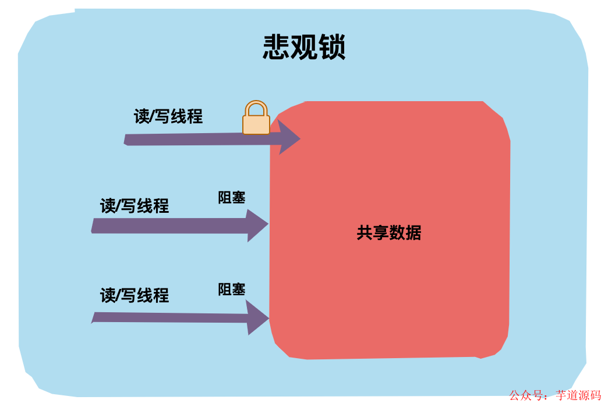

# 乐观锁与悲观锁
## 悲观锁

`悲观锁`对应于生活中悲观的人，悲观的人总是想着事情往坏的方向发展。
举个生活中的例子，假设厕所只有一个坑位了，悲观锁上厕所会第一时间把门反锁上，这样其他人上厕所只能在门外等候，这种状态就是「阻塞」了。
回到代码世界中，一个共享数据加了悲观锁，那线程每次想操作这个数据前都会假设其他线程也可能会操作这个数据，所以每次操作前都会上锁，这样其他线程想操作这个数据拿不到锁只能阻塞了。

